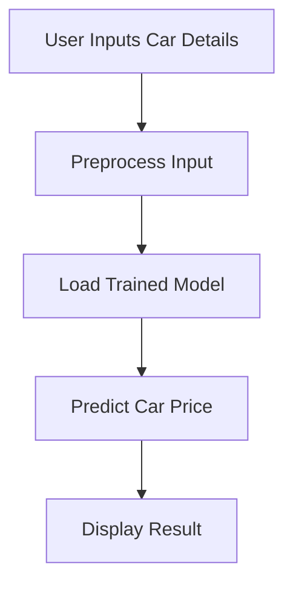

# Car Price Predictor

## Introduction

Car Price Predictor is a machine learning project designed to estimate the price of a car based on its features. It leverages historical data and predictive modeling to provide accurate car price estimations. This project is ideal for car dealerships, buyers, and sellers who want to understand the fair market value of vehicles using automated methods.

## Features

- Predicts car prices based on key features such as make, model, year, mileage, and more.
- Interactive user interface for easy data input and visualization.
- Uses advanced regression algorithms for higher accuracy.
- Data preprocessing and cleaning pipeline.
- Model training, evaluation, and persistence.
- Visualization of model performance and feature importance.
- Easily customizable for new data sources and features.

## Requirements

To run the project, ensure you have the following installed:

- Python 3.7 or above
- pip (Python package manager)
- The following Python libraries:
  - numpy
  - pandas
  - scikit-learn
  - matplotlib
  - seaborn
  - streamlit


## Usage

You can use the Car Price Predictor in two main ways: via the command line or through an interactive web application.

### Running the Web Application

The project includes a Streamlit app for user-friendly interaction.

1. Start the Streamlit server:

   ```bash
   streamlit run app.py
   ```

2. Open the provided local server URL in your browser.

3. Fill in the car details using the web form and view the predicted price instantly.


## Configuration

- **Data Source:** Modify the dataset path in the configuration section of the scripts as needed.
- **Model Parameters:** You can customize the regression model (e.g., change algorithms, tune hyperparameters) in `train.py`.
- **Feature Selection:** Add or remove features from the dataset and update the preprocessing steps accordingly.
- **Persistence:** Adjust the model save/load paths if you want to use different directories or file names.

## Project Structure

```plaintext
Car-price-predictor/
├── app.py                # Streamlit application
├── train.py              # Model training script
├── predict.py            # Prediction script
├── requirements.txt      # Python dependencies
├── data/
│   ├── car_data.csv      # Sample input dataset
│   └── sample_input.csv  # Example input for prediction
├── models/
│   └── car_price_model.pkl # Saved trained model
└── README.md             # Project documentation
```

## Example Workflow



